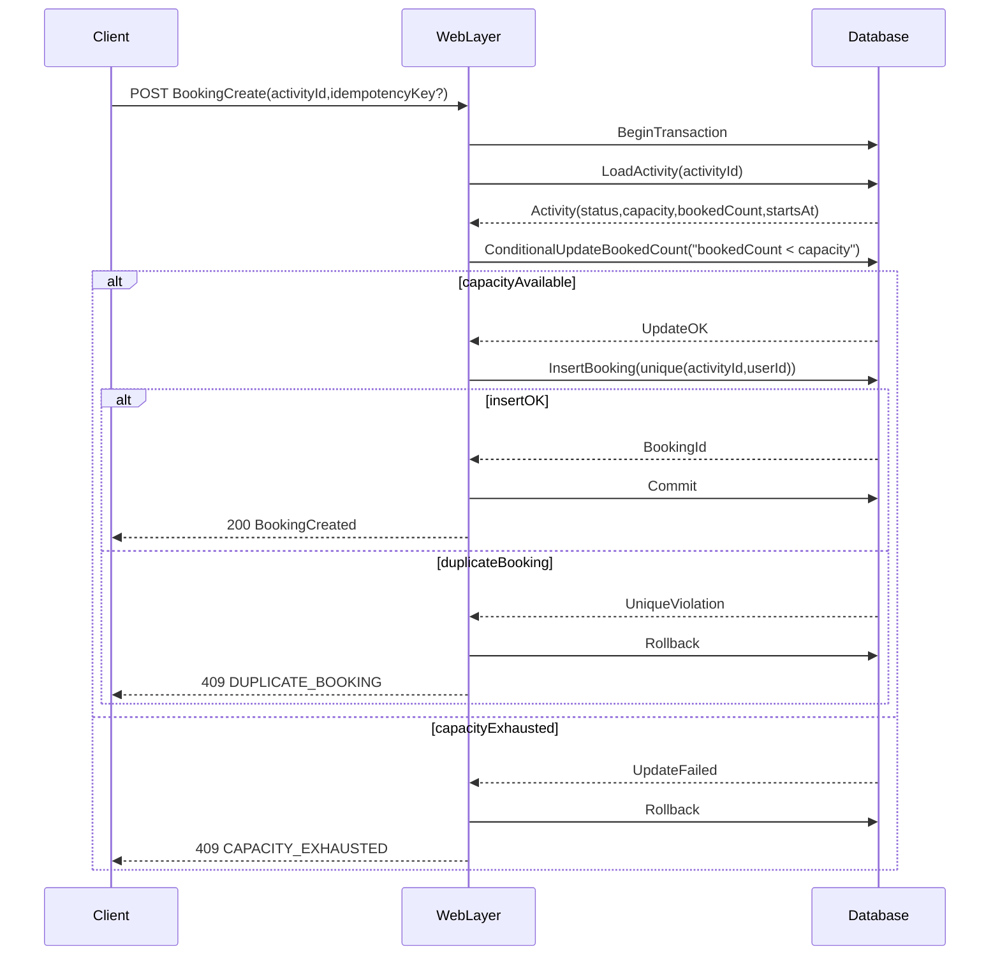

/**
 * Developed by eBrook Group.
 * Copyright © 2026 eBrook Group (https://www.ebrook.com.tw)
 */

### 1. 背景与目标 (Background & Goals)

#### 1.1 背景（业务与技术痛点）
- **业务侧痛点**：活动发布与预约分散在人工/非结构化渠道，无法统一追踪预约状态、名额占用与取消；缺少用户自助管理入口。
- **技术侧痛点**：名额型预约存在明显并发竞争（超卖/重复预约），且需要可审计的状态流转与责任归属；后台需要可扩展的权限治理以支持运营与管理员协作。

#### 1.2 本需求解决的问题
- **前台**：用户可浏览活动、注册/登录并发起预约；活动信息应可按发布状态控制可见性。
- **个人中心**：用户可查看与管理已预约活动（至少支持取消），并可维护个人资料。
- **后台（Filament 4.0）**：发布/管理活动、管理预约、支持活动图片上传与基础的审计追溯。

#### 1.3 架构目标
- **可扩展性**：活动与预约的状态机可演进（如候补、审核、支付等），存储可从本地扩展到对象存储；后台权限可从“角色”演进到“细粒度权限”。
- **可维护性**：明确领域边界（活动/预约/用户/媒体），在接口契约与数据结构层面稳定对外行为，降低未来改动的耦合面。
- **可审计性**：关键业务事件可追溯（谁在何时发布活动、谁预约/取消、名额变化原因），并满足最小必要日志原则。
- **NFR**：并发一致性（避免超卖与重复预约）、性能（列表读取可缓存）、可用性（多环境一致部署）、安全（认证授权与上传治理）。

#### 1.4 Out of Scope（本期不做但已识别）
- **支付**（费用/退款）、**候补名单**、**人工审核**、**复杂报名表单**（自定义字段/附件）、**站内信/短信/邮件通知**、**活动签到/核销**、**导出报表与 BI**。
- **多租户/多组织隔离**（如果未来需要，将引入组织维度与数据隔离策略）。
- 以上若需纳入，本文件将作为基线补充 ADR 与迁移计划。

---

### 2. 核心接口定义 (API / Service Contracts)

> 说明：项目当前为 Laravel 12 + Filament ^4.0。\n\
> 认证与会话采用 **双 guard + 双账户体系**：\n\
> - **前台用户**：`web` guard（session），模型 `App\\Models\\User`，表 `users`。\n\
> - **后台管理员**：`admin` guard（session），模型 `App\\Models\\Admin`，表 `admins`，后台入口路径为 `/admin`（Filament Panel）。\n\
> 当前版本前台主要为 **Blade 表单提交 + 重定向**（CSRF 保护），暂未对外提供 `/api/*` 形态的公开 REST API。\n\
> 本节以“HTTP 契约”描述外部可观测行为，**并标注与现状一致的实现细节**；“待确认/未实现”项将显式标注。

#### 2.0 当前实现对照（以代码为准）

- **已实现（前台）**：
  - 活动列表：`GET /activities`（支持 `q/from/to` 过滤 + 分页），仅展示 **已发布、已到发布时间、且未开始** 的活动。
  - 活动详情：`GET /activities/{activity}`（仅对外可见活动可访问），展示图片与“立即预约”按钮（不可预约时显示禁用原因）。
  - 用户注册/登录/登出：`GET/POST /register`、`GET/POST /login`、`POST /logout`；登录具备基础限流（10 次/分钟/邮箱+IP）。
  - 我的预约：`GET /me/bookings`；取消预约：`POST /bookings/{booking}/cancel`（**活动开始前 < 60 分钟 或 已开始** 时禁止取消）。
  - 个人资料：`GET /me/profile`、`POST /me/profile`（仅支持更新 `name`）。
- **已实现（后台 Filament /admin）**：
  - 活动管理：草稿/发布/下架/归档、容量校验（不可小于已预约人数）、图片上传（类型/大小/数量限制）。
  - 预约管理：查询/筛选、**后台代预约（仅 admin）**、**后台代取消（仅 admin）**。
  - 管理员管理：创建/编辑/删除（仅 admin；禁止删除自己/最后一个启用的 admin）。
- **已实现（审计）**：
  - 预约创建/取消与后台代操作会写入 `audit_events`（`booking_created`/`booking_cancelled`/`admin_booking_created_on_behalf`/`admin_booking_cancelled_on_behalf`）。
- **未实现/待补充**（文档仍保留为目标态）：
  - `/api/*` 公共 API 版本；个人资料更新审计；活动发布/下架/归档/图片增删的审计事件；更细粒度 RBAC（目前为 `admin/operator` 最小角色）。

#### 2.1 认证与会话（前台）

##### Auth.Register（用户注册）
- **接口名称与职责**：创建用户账号并建立会话。
- **入口（已实现）**：`POST /register`
- **输入参数（已实现）**
  - `name`: string, 必填, 长度 1..255
  - `email`: string, 必填, email 格式, 唯一
-  - `password`: string, 必填, 最小长度 **8**
- **输出结构（已实现为 Blade 重定向）**
  - **成功**：302，登录并 `session()->regenerate()`，重定向至 `GET /activities`
  - **可预期失败**：302 + session errors（字段校验失败/邮箱已存在）
- **调用方/被调用方**：前台页面/客户端 → Laravel Web 层
- **幂等性与副作用**：非幂等（会创建账号）；对同一邮箱重复注册会返回可预期失败
- **失败时责任归属**：服务端负责保证唯一性与密码安全；客户端负责呈现校验错误

##### Auth.Login（用户登录）
- **入口（已实现）**：`POST /login`
- **输入参数**：`email`, `password`
- **输出结构（已实现为 Blade 重定向）**：成功建立 session 并 `session()->regenerate()`；失败以表单校验错误形式返回（不区分“邮箱不存在/密码错误”）。
- **幂等性**：幂等（多次登录刷新 session）
- **安全要求（已实现）**：按 `email + IP` 维度限流：**1 分钟内最多 10 次尝试**，超过后提示“登录尝试过于频繁，请稍后再试。”

##### Auth.Logout（用户登出）
- **入口（已实现）**：`POST /logout`
- **副作用（已实现）**：`Auth::logout()` + `session()->invalidate()` + `regenerateToken()`

> 本期明确：**不引入邮箱验证**作为预约前置条件（`email_verified_at` 不参与业务校验）。

#### 2.2 活动（前台可读）

##### Activity.List（活动列表）
- **接口名称与职责**：按条件返回可预约的活动列表（仅对外发布）。
- **入口（已实现）**：`GET /activities`（页面）
- **输入参数（Query）**
  - `q`: string, 可选（标题/摘要模糊查询）
  - `from`: datetime, 可选（开始时间下界）
  - `to`: datetime, 可选（开始时间上界）
  - `page`, `perPage`: int, 可选（分页）
- **输出结构（已实现为 Blade 页面渲染）**
  - `items[]`: `{ id, title, startsAt, endsAt, timezone, location?, coverImageUrl?, remainingCapacity, status }`
  - `pageInfo`: `{ page, perPage, total }`
- **幂等性**：幂等；无副作用
- **失败责任（现状）**：服务端保证只返回“可见且未开始”的活动；页面负责分页与展示

> 现状补充（与目标态一致性说明）：当前列表额外约束 `starts_at > now()`，因此**已发布但已开始/已结束的活动不会出现在前台列表**（即便仍为 published）。

##### Activity.Get（活动详情）
- **入口（已实现）**：`GET /activities/{activityId}`
- **输出（已实现）**：活动详情页（含图片列表、剩余名额、可预约按钮及禁用原因）。当活动不可见（非 published 或未到 published_at）时返回 404。

#### 2.3 预约（个人中心/前台）

##### Booking.Create（创建预约）
- **接口名称与职责**：为已登录用户创建某活动的预约，并占用名额。
- **入口（已实现）**：`POST /activities/{activityId}/bookings`
- **输入参数（已实现）**
  - `idempotencyKey`: string, 可选（服务端支持；当前前台页面未显式提交该字段）
  - 其他扩展字段（如备注/报名信息）：待确认（若无则 Out of Scope）
- **输出结构（已实现为 Blade 重定向）**
  - **成功**：302，重定向到 `GET /me/bookings` 并写入 success flash
  - **可预期失败（以表单错误呈现）**
    - `ACTIVITY_NOT_FOUND`：活动不存在或不可见
    - `ACTIVITY_NOT_BOOKABLE`：未发布/未到发布时间/已开始（`now >= starts_at`）
    - `CAPACITY_EXHAUSTED`：名额不足
    - `DUPLICATE_BOOKING`：同一用户重复预约同一活动（唯一约束保障）
- **幂等性与副作用（已实现）**
  - 唯一约束 `unique(activity_id, user_id)` 保证不会产生重复预约
  - 当提供 `idempotencyKey` 且数据库中已有同一活动+用户且 `idempotency_key` 相同的记录时，服务端会直接返回该记录（等价于幂等重放成功）；若 key 不同则返回 `DUPLICATE_BOOKING`
  - 副作用：名额占用、产生预约记录、产生审计事件
- **失败时责任归属**
  - 服务端：保证不超卖、不产生重复预约、不泄漏内部异常细节
  - 客户端：在 `CAPACITY_EXHAUSTED` 时给出可预期提示并允许用户返回列表

##### Booking.Cancel（取消预约）
- **接口名称与职责**：用户取消自己的预约，并释放名额（若规则允许）。
- **入口（已实现）**：`POST /bookings/{bookingId}/cancel`
- **输入参数（已实现）**
  - `reason`: string, 可选（用于审计；最大长度 500）
- **输出结构（已实现为 Blade 重定向）**
  - **成功**：302 back 并写入 success flash
  - **可预期失败（以表单错误呈现）**
    - `BOOKING_NOT_FOUND`：不存在
    - `FORBIDDEN`：非本人预约
    - `CANCEL_DEADLINE_PASSED`：超过取消截止（**距离活动开始 < 60 分钟或已开始**）
- **副作用（已实现）**：释放名额、记录审计事件

##### Booking.ListMine（我的预约列表）
- **入口（已实现）**：`GET /me/bookings`
- **输出（已实现为 Blade 页面渲染）**：分页返回用户预约记录（加载关联活动；同时 bookings 中保留 `activity_snapshot` 作为审计/历史快照）

#### 2.4 个人资料（个人中心）

##### Profile.Get / Profile.Update
- **入口（已实现）**：`GET /me/profile` / `POST /me/profile`
- **输入（已实现）**：`name`
- **安全（已实现）**：仅允许本人更新（路由受 `auth` 中间件保护）
- **审计（未实现）**：个人资料更新目前不写 `audit_events`，如需合规追溯可在后续补充 `profile_updated` 事件

#### 2.5 后台（Filament 管理面）

> 说明：后台以 Filament Panel 提供 UI 交互为主，不要求对外暴露公共 API；但仍需要定义“管理能力的契约”与审计策略。

##### Admin.ActivityManagement（活动管理）
- **职责**：活动创建/编辑/删除（或归档替代删除）/发布/下架/归档；维护容量、时间、描述；维护活动图片。
- **并发假设**：编辑与发布属于低并发操作；但发布后会引入预约高并发读写。
- **失败责任**：后台操作失败需可回滚或给出明确错误（例如图片上传失败不得留下孤儿记录）。
- **关键规则（前台可预约门槛）**
  - 活动必须为 `published` 才可在前台列表/详情可见与可预约。
  - “发布生效时间”以 `published_at` 为准：仅当 `now >= published_at` 时才允许前台预约（且仍需满足其他可预约校验，如 `now < starts_at`）。
  - 下架（`unpublished`）后：前台不可见且不可新预约；已有预约仍可查询（取消规则不变）。
  - 归档（`archived`）后：前台不可见且不可新预约；已有预约仍可查询（取消规则不变）。
- **新增（Create）**
  - 默认创建为 `draft`；`published_at` 为空；不得对外可见。
  - 必填字段：`title`, `starts_at`, `timezone`, `capacity`（其余按产品确认）。
- **编辑（Update）**
  - `draft`：允许修改全部字段（含时间/容量）。
  - `published`：允许修改非破坏性字段（标题/描述/地点/图片等）；对“时间/容量”修改需明确规则：
    - 增加容量：允许（现状：允许；**未对该变更写入审计事件**）。
    - 减少容量：不得小于当前有效预约数（否则拒绝并提示 `CAPACITY_CONSTRAINT_VIOLATION`；现状：在后台编辑页会校验 `capacity >= booked_count`）。
    - 修改 `starts_at`：将影响取消截止与可预约校验（现状：允许；**未对该变更写入审计事件**）。
- **删除（Delete）与归档（Archive）**
  - 本期建议：**不做物理删除**（尤其是已有预约的活动），以“归档/下架”替代删除，避免审计缺失与历史不可追溯。
  - 若必须支持删除：
    - 无预约：允许删除（同时清理图片与关联记录）。
    - 有预约：默认禁止删除（当前实现：当活动存在任意 booking 时，“删除”按钮不显示）。
  - 归档：仅影响前台可见性与后台筛选，不删除历史数据。

##### Admin.BookingManagement（预约管理）
- **职责**：查询预约、按活动查看预约名单、（可选）后台代用户取消/标记异常。
- **明确**：允许后台**代预约**与**代取消**（仅限授权角色/权限）。所有代操作必须记录审计事件（包含被代操作的 `user_id`、操作者 `actor_id`、操作原因与请求关联 ID）。
  - **现状实现**：后台“代预约/代取消”仅 `admin` 角色可用；`operator` 仅可查看与编辑活动，不可创建预约/代取消。
- **契约补充（后台能力）**
  - 代预约：操作者为某 `user_id` 创建某 `activity_id` 的预约（与前台同等并发/幂等/名额约束）
  - 代取消：操作者为某 `user_id` 取消其 `booking_id`（仍受“取消截止规则”约束，除非另行定义“强制取消”能力；本期不引入强制取消）

##### Admin.MediaUpload（活动图片上传）
- **职责**：上传活动图片至本地 `public` disk，绑定到活动。
- **约束**：默认限制为 **jpg/png/webp**；**单张 ≤ 5MB**；**每活动 ≤ 10 张**；命名策略、清理策略（见第 8 节）。
  - **现状实现**：存储目录为 `public/activity-images`；上传后会记录 `mime_type`、`size_bytes`；支持图片裁剪（Filament image editor）。

---

### 3. 数据库 / 数据结构设计 (Schema Design)

> 说明：当前默认数据库连接为 `sqlite`（开发默认），生产建议使用 MySQL/MariaDB（与并发/锁行为更一致）。本节按关系型数据库（InnoDB）设计约束；SQLite 下的锁语义可能不同，需在 Dev/Staging 环境验证并发行为。\n\
> 字段命名与类型以 Laravel 迁移可表达为基准，但本文不提供具体迁移代码。

#### 3.1 表结构概览
- **`activities`**：活动主表（发布态、时间、容量、可见性）。
- **`activity_images`**（可选，若仅封面可合并到 `activities`）：活动图片元数据与存储引用。
- **`bookings`**：预约表（用户与活动的关系 + 状态流转）。
- **`audit_events`**（已实现）：业务审计事件表（当前用于记录预约创建/取消与后台代操作；活动相关审计仍待补充，见第 9 节）。
- **RBAC（现状 + 演进方向）**
  - 现状：后台管理员表 `admins` 以 `role=admin/operator` 实现最小 RBAC；未引入 permissions 表
  - 方案 A（建议演进）：引入成熟 RBAC 组件（例如 Spatie Permission）形成 `roles/permissions` 等表
  - 方案 B（备选演进）：自定义最小角色表 `roles` + `user_roles`（后续再演进到权限）

#### 3.2 `activities`（活动）
- **主键**：`id`（bigint）
- **核心字段**
  - `title`：string, not null
  - `summary`：string/text, null（可选）
  - `description`：text, null
  - `starts_at`：datetime, not null
  - `ends_at`：datetime, null（若为空代表无结束时间，待确认）
  - `timezone`：string, not null（建议保存 IANA timezone；若统一 UTC 则可省略但需明确）
  - `location`：string, null（待确认是否需要）
  - `capacity`：int, not null（>0）
  - `booked_count`：int, not null（默认 0，用于快速读取剩余名额；见并发策略）
  - `status`：enum/string, not null（建议：`draft`/`published`/`archived`）
  - `published_at`：datetime, null
  - `created_by` / `updated_by`：bigint, null（用于记录后台操作者；现状：后台写入 `admin.id`，但不强制外键约束）
  - `created_at` / `updated_at`
- **索引建议**
  - `(status, starts_at)`：用于列表与过滤
  - `published_at`：用于运营统计（可选）
- **一致性假设**
  - `booked_count` 必须与 `bookings` 中“有效预约”一致；通过事务与约束尽可能维持（见 6 节）。

#### 3.3 `activity_images`（活动图片，推荐独立表）
- **主键**：`id`
- **外键**：`activity_id` → `activities.id`（on delete cascade）
- **核心字段**
  - `disk`：string, not null（本期为 `public`）
  - `path`：string, not null（相对路径）
  - `mime_type`：string, not null
  - `size_bytes`：bigint, not null
  - `checksum`：string, null（用于去重/完整性校验，可选）
  - `sort_order`：int, not null（用于多图排序）
  - `created_by`：bigint, null（用于记录后台上传操作者；现状：写入 `admin.id`，不强制外键约束）
  - `created_at`
- **索引**
  - `(activity_id, sort_order)`
- **向后兼容与迁移风险**
  - 若未来迁移到对象存储，需要 `disk` + `path` 组合保持稳定；建议提前引入 `disk` 字段以降低迁移成本。

#### 3.4 `bookings`（预约）
- **主键**：`id`
- **外键**
  - `activity_id` → `activities.id`（on delete restrict 或 cascade：待确认。建议 restrict，避免误删带来审计缺失）
  - `user_id` → `users.id`
- **核心字段**
  - `status`：enum/string, not null（建议：`active`/`cancelled`）
  - `booked_at`：datetime, not null
  - `cancelled_at`：datetime, null
  - `cancel_reason`：string/text, null（可选）
  - `idempotency_key`：string, null（用于去重/重试）
  - `activity_snapshot`：json/text, null（建议保存活动标题/开始时间等关键字段快照，便于审计与活动变更后仍可追溯；待确认）
  - `created_at` / `updated_at`
- **唯一约束（关键）**
  - `unique(activity_id, user_id)`：禁止同一用户重复预约同一活动（满足“重复点击/重放”安全底线）。
  - 幂等键：现状同时存在 `unique(activity_id, user_id, idempotency_key)`（但由于已存在 `unique(activity_id, user_id)`，该约束更多用于表达意图；是否保留/调整为 `unique(user_id, idempotency_key)` 可在后续明确）。
- **查询模式预期**
  - 用户个人中心：按 `user_id` + `status` + `booked_at desc`
  - 后台：按 `activity_id` + `status` + `booked_at desc`
- **数据增长**
  - `bookings` 按活动数量与活跃用户线性增长；长期应考虑归档策略与索引维护（见 11 节）。

#### 3.5 并发与一致性策略（与表结构绑定）
- **名额扣减策略（强一致）**：预约创建必须在事务内完成：
  - 先验证活动可预约（状态/时间窗口/取消规则等）
  - 使用“原子条件更新”或“行锁”确保 `booked_count < capacity` 时才占用
  - 插入 `bookings` 时依赖唯一约束拦截重复预约
  - 任一失败需保证不产生“占用但无记录”的不一致（见第 6 节详细策略）
- **取消释放策略**：取消应是幂等，且只对 `active`→`cancelled` 做一次性状态变更；释放名额与状态变更需在同一事务内完成。

---

### 4. 前端与交互入口（如适用）

#### 4.1 功能入口与触发方式
- **前台入口**：`/`（现为 welcome）建议扩展为活动列表入口；活动详情页提供“预约”触发。
- **认证入口**：`/login`、`/register`（待确认使用的认证 UI 形态：Blade/Breeze/Jetstream/自研）。
- **个人中心**：`/me`、`/me/bookings`、`/me/profile`。
- **后台入口（Filament）**：`/admin`，由 Filament Panel 提供登录与后台功能。

#### 4.2 与后端契约边界
- 前台若采用 Blade：与后端以表单提交/重定向为主，契约体现为 HTTP 状态码与错误消息 key（不透出内部异常）。
- 前台若采用 API：契约体现为 JSON schema + 错误码；需要 CSRF/session 或 token 方案（本期建议保持 session，减少双栈认证复杂度；token 化为演进方向）。

#### 4.3 性能与渲染假设
- **首屏**：活动列表需可分页与缓存（避免大列表一次性渲染）。
- **缓存**：活动列表/详情可缓存（基于发布态与更新时间的失效策略）；预约相关接口不缓存。
- **SEO**：若需要公开活动页的 SEO（待确认），建议活动详情采用服务端渲染并提供稳定 URL。

---

### 5. 核心业务流程 (Business Flow)

#### 5.1 正常流程：浏览与预约
1. 用户访问活动列表与详情（仅能看到 `published` 活动）。
2. 用户未登录时点击预约 → 跳转登录/注册，完成后返回原活动页面（待确认是否需要）。
3. 用户提交预约请求。
4. 服务端执行：校验活动可预约 → 并发占用名额 → 创建预约记录 → 写入审计事件 → 返回成功。

#### 5.2 正常流程：取消预约
1. 用户在个人中心打开“我的预约”。
2. 选择目标预约并发起取消。
3. 服务端执行：校验归属与截止规则 → 状态从 `active`→`cancelled` → 释放名额 → 写入审计事件。

#### 5.3 后台流程：发布活动与管理预约
1. 运营/管理员登录 `/admin`。
2. 创建/编辑活动（`draft`）。
3. 上传活动图片（写入 `activity_images` 并绑定活动）。
4. 发布活动（状态变为 `published`，对前台可见）。
5. 在后台查看预约列表（按活动维度或全局查询）。

#### 5.4 mermaid：预约创建的关键状态变更点

---

### 6. 边缘情况与一致性问题 (Edge Cases & Consistency)

#### 6.1 并发抢名额（超卖防护）
- **问题**：多个用户同时预约同一活动，若仅“先读后写”会导致超卖。
- **策略**（强一致，已定案）：**行锁 + 事务**（`SELECT ... FOR UPDATE` 锁定活动行，检查并更新 `booked_count`，再插入 booking）。
- **约束**：该策略必须与 `bookings` 的唯一约束一起使用，防止重复预约导致计数偏移。

#### 6.2 重复请求/网络重试（幂等性）
- **问题**：客户端重试可能导致重复预约或重复取消。
- **策略**
  - **预约创建**：推荐引入 `idempotencyKey`（客户端生成）并落库；重放请求应返回与首次一致的业务结果（成功则返回同 booking；失败则返回失败）。
  - **取消**：对已取消记录返回 `ALREADY_CANCELLED` 或直接返回成功态（推荐幂等化为成功态，避免客户端复杂分支）。
- **待确认**：是否强制所有写请求提供 `idempotencyKey`；若不强制，则至少保证唯一约束 `unique(activity_id,user_id)`。

#### 6.3 活动状态变化与已有预约
- **问题**：后台下架/归档活动时，已有预约如何处理？
- **建议约束**
  - 下架后：不允许新预约；已有预约保持可查询；取消仍遵循统一规则：**活动开始前 1 小时内禁止取消**。
  - 归档：仅影响前台可见性，不删除历史记录。
- **禁止**：物理删除带预约的活动（除非有严格的数据迁移与审计方案）。

#### 6.4 时间与时区一致性
- **问题**：活动开始时间与取消截止时间若跨时区，可能出现规则误判。
- **策略**：数据库统一存 UTC（建议）并在活动记录中保留 `timezone` 作为显示/规则计算基准（或明确全系统固定时区）。
- **待确认**：活动是否需要地点/时区；若所有活动同一地区可简化。

#### 6.5 图片上传一致性与清理
- **问题**：上传成功但绑定失败、绑定成功但文件未落盘、删除活动图导致孤儿文件。
- **策略**：采用“先落盘后落库”或“先落临时区后确认提交”的一致性流程；必须具备后台清理孤儿文件的治理策略（见第 11 节演进）。

---

### 7. 非功能性需求（Non-Functional Requirements）

#### 7.1 性能（Performance）
- 活动列表/详情：p95 < 200ms（不含前端渲染），可通过缓存与索引实现。
- 预约创建/取消：p95 < 500ms；在名额热点场景允许较多 409（`CAPACITY_EXHAUSTED`）但不得产生超卖。
- 数据库：`activities(status, starts_at)`、`bookings(user_id, booked_at)`、`bookings(activity_id, booked_at)` 等索引为性能底线。

#### 7.2 可用性（Availability）
- 目标：核心预约链路可用性 >= 99.9%（以月为单位，待确认）。
- 依赖：数据库、会话存储、文件存储（本地 disk）均需纳入监控与告警（第 9 节）。

#### 7.3 可扩展性（Scalability）
- 热点活动预约会对单行 `activities` 产生写竞争；需要明确“单活动最大 QPS”预期（待确认）并准备演进方案（例如排队/令牌桶/分片计数）。
- 图片存储从本地到对象存储的迁移路径应在表结构中预留（`disk/path`）。

#### 7.4 可维护性（Maintainability）
- 领域边界：活动、预约、用户、媒体、权限应分离；对外契约稳定，内部实现可演进。
- 状态机：`activities.status` 与 `bookings.status` 必须受控变更（后台操作、用户操作、系统策略）。

#### 7.5 可测试性（Testability）
- 必须具备：并发预约（模拟冲突）、重复请求幂等、**取消截止规则（活动开始前 1 小时内禁止取消）**、权限矩阵的集成测试策略。
- 建议：在 Staging 使用与 Prod 一致的数据库引擎（MySQL/MariaDB）验证锁/事务语义。

---

### 8. 信息安全、合规与审计 (Security, Compliance & Audit)

#### 8.1 认证 / 授权边界
- **前台认证**：使用 Laravel `web` session（已存在），所有写操作要求已登录。
- **后台认证**：Filament `/admin` 使用其登录流程（已配置），并通过 `Authenticate` 中间件保护。
- **授权（RBAC）**
  - **现状实现（最小角色）**：`admins.role` = `admin` / `operator`，并带 `admins.is_active`（禁用账号不可登录后台）。
  - **权限粒度（现状）**
    - 活动管理：`admin`/`operator` 可创建/编辑/发布/下架/归档/删除（删除仅限无预约的活动）。
    - 预约管理：`admin` 可代预约/代取消；`operator` 仅可查看预约列表（无创建、无代取消）。
    - 管理员管理：仅 `admin` 可管理管理员账号。
  - **待确认/演进**：暂未引入细粒度 permissions（如 Spatie Permission）；如未来需要，可将上述能力拆分为权限点并记录权限变更审计。
  - **已定案补充**：后台“代预约/代取消”为高风险能力，现状默认仅授予 `admin`，并写入强审计（见 8.3、9.1）。

#### 8.2 敏感数据处理原则
- 密码仅存哈希（当前 `users.password` 已为 hashed cast）。
- 不在任何日志/审计事件中记录：密码明文、session payload、CSRF token、完整 user-agent（可截断/哈希化）。

#### 8.3 日志与审计要求（可追溯性）
- 必须可追溯：活动发布/下架、容量变更、图片上传/删除、预约创建/取消、后台代操作（若允许）。
- 审计事件应包含：`event_type`、`occurred_at`、`actor_type`（user/admin）、`actor_id`、`target_type`、`target_id`、`metadata`（最小必要）。
  - 现状补充：由于 `actor_type` 可能为 user/admin，`audit_events.actor_id` **不强制外键约束**（避免固定指向 `users` 或 `admins`）。
  - 对“代操作”，`metadata` 必须额外包含：`impersonated_user_id`（被代操作用户）、`reason`（原因）、`request_id/trace_id`（关联 ID），以满足责任追溯。

#### 8.4 第三方依赖信任假设
- 本期图片为本地存储，无外部对象存储依赖。
- 若未来接入邮件/短信/对象存储，需补充供应商审计与密钥治理（Secrets 管理）。

#### 8.5 合规性考虑（待确认）
- GDPR/用户同意/数据删除：是否需要“删除账号”与“删除预约历史”的流程？（通常预约记录需保留以满足审计/纠纷处理，需法务确认）
- 日志留存周期：待确认（建议：安全审计日志 180 天起）

---

### 9. 日志、监控与可观测性 (Observability)

#### 9.1 关键业务事件记录（结构化）
- **已实现**
  - `booking_created` / `booking_cancelled`
  - `admin_booking_created_on_behalf` / `admin_booking_cancelled_on_behalf`（包含 `impersonated_user_id` 与 `reason`）
- **未实现（规划保留）**
  - `activity_created` / `activity_updated` / `activity_published` / `activity_unpublished` / `activity_archived`
  - `activity_image_uploaded` / `activity_image_deleted`
  - `auth_login_success` / `auth_login_failed`（当前前台登录限流已实现，但未写入 `audit_events`）

#### 9.2 指标（Metrics）建议
- **业务指标**
  - `bookings_create_success_total`, `bookings_create_capacity_exhausted_total`, `bookings_create_duplicate_total`
  - `bookings_cancel_success_total`, `bookings_cancel_deadline_block_total`
  - `activities_published_total`
- **系统指标**
  - HTTP 延迟（p50/p95/p99）按路由聚合
  - DB 慢查询/锁等待（Staging/Prod）
  - 队列积压（若启用异步任务）
  - 磁盘空间与 `storage/app/public` 增长速率（本期关键）

#### 9.3 告警建议
- 预约创建错误率（5xx）突增
- DB 锁等待/连接耗尽
- 磁盘空间低水位（<15%）
- 异常活动：同一活动短时间 `CAPACITY_EXHAUSTED` 激增（可能为热点/刷接口/配置错误）

#### 9.4 不记录内容与原因说明
- **不记录**：密码、token、完整 session、原始上传文件内容、完整 PII（可用 userId 代替）。
- **原因**：降低泄露风险与合规成本，遵循最小必要原则。

---

### 10. 验收标准 (Acceptance Criteria)

#### 10.1 前台与认证
- Given 未登录用户访问活动详情，When 点击预约，Then 被引导至登录/注册流程并在成功后可继续预约（回跳策略：待确认）。
- Given 已登录用户，When 在注册邮箱已存在的情况下再次注册，Then 返回可预期失败且不泄漏系统异常。

#### 10.2 活动可见性与预约正确性
- Given 活动状态为 `draft`，When 前台请求列表/详情，Then 不可见。
- Given 活动状态为 `published` 但 `now < published_at`，When 前台请求列表/详情或点击预约，Then **不可见**（当前实现：列表/详情均以 `published_at <= now` 作为可见性前置条件）。
- Given 活动状态为 `published` 且名额 > 0，When 用户预约，Then 预约成功且剩余名额减少 1。
- Given 活动名额已满，When 任意用户预约，Then 返回 `CAPACITY_EXHAUSTED`，且不得出现超卖。
- Given 同一用户对同一活动重复点击预约，When 发生重复请求，Then 返回 `DUPLICATE_BOOKING` 或通过幂等键返回同一成功结果（按设计一致）。

#### 10.6 后台活动管理 CRUD（补充）
- Given 运营/管理员在后台创建活动，When 保存但未发布，Then 活动为 `draft` 且前台不可见、不可预约。
- Given 管理员在后台发布活动并设置 `published_at`，When `now < published_at`，Then 前台不可见（因此不可预约）；When `now >= published_at` 且 `now < starts_at`，Then 前台可预约。
- Given 活动已发布且存在有效预约，When 管理员尝试将 `capacity` 调整到小于有效预约数，Then 操作失败并提示容量约束错误（现状：**不写审计事件**）。
- Given 活动存在预约，When 管理员尝试删除活动，Then 默认不允许删除（现状：**UI 不提供删除入口**；且不写审计事件；建议用归档替代删除）。

#### 10.3 取消与一致性
- Given 用户存在 `active` 预约，When 在**活动开始前 >= 1 小时**发起取消，Then 预约状态变为 `cancelled` 且剩余名额增加 1。
- Given 距离活动开始时间 **< 1 小时**，When 用户取消，Then 返回 `CANCEL_DEADLINE_PASSED` 且名额不变化。
- Given 活动开始时间 **<= now**，When 用户取消，Then 返回 `CANCEL_DEADLINE_PASSED` 且名额不变化。
- Given 同一取消请求重放，When 重复调用取消，Then 结果应幂等（返回已取消态且不重复释放名额）。

#### 10.4 后台与权限
- Given 运营角色，When 访问后台活动管理，Then 允许创建/发布活动但（待确认）不可做用户管理等超权限行为。
- Given 非授权角色，When 访问预约管理，Then 被拒绝并记录安全审计（至少有访问拒绝日志）。
- Given 非 `admin` 角色，When 尝试执行后台代预约/代取消，Then 被拒绝并产生审计事件（记录操作者与被代操作用户）。

#### 10.5 图片上传
- Given 后台上传图片，When 文件类型/大小/数量不满足约束（仅允许 jpg/png/webp；单张 ≤ 5MB；每活动 ≤ 10 张），Then 返回可预期失败并不落盘。
- Given 图片上传成功，When 绑定到活动失败，Then 不应产生无法追踪的孤儿文件（需有治理机制或事务式流程）。

---

### 11. 风险、限制与技术决策 (Risks & Trade-offs)

#### 11.1 已识别风险
- **本地 public disk 存储风险**：磁盘容量与备份、跨实例部署一致性（多机情况下文件不共享）、清理与合规成本。
- **名额热点写竞争**：单活动高并发会导致锁争用/延迟上升，需明确容量与峰值预期。
- **SQLite 与生产数据库差异**：Dev 默认 sqlite 的事务/锁行为与 MySQL 不一致，可能掩盖并发问题。
- **权限误配置风险**：后台多角色若缺乏统一权限矩阵与审计，易出现越权操作。
- **代操作滥用风险**：允许后台代预约/代取消会显著放大误操作与合规风险，必须以最小权限、双人复核（可选，待确认）与强审计进行治理。
- **时区与规则歧义**：取消截止规则已明确为“**活动开始前 1 小时内禁止取消**”；开放窗口仍未明确（待确认），可能引发预约可用性争议。

#### 11.2 架构取舍及原因
- **选择 session-based 认证（web guard）**：与 Laravel/Filament 默认一致，降低双栈认证复杂度；代价是 API 场景需要 CSRF 与同站策略配合。
- **引入 `booked_count` 计数**：读取性能更优，列表无需实时聚合；代价是必须用事务保证与 bookings 的一致性。
- **图片存本地**：实现成本低；代价是横向扩展与灾备复杂，建议中长期迁移对象存储。

#### 11.3 延后处理的问题与演进方向
- **对象存储迁移**：将 `disk=public` 演进为 `s3/minio`，引入签名 URL 与生命周期管理。
- **通知系统**：预约成功/取消的站内信/邮件/短信（需合规与退订策略）。
- **更强并发治理**：热点活动引入排队/令牌桶、读写分离、缓存与异步化（如先受理后确认）。
- **审计存储**：从结构化日志演进为 `audit_events` 表与报表化审计查询。

